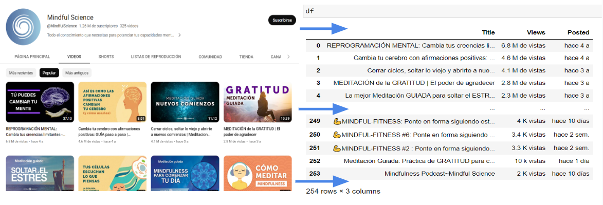

# YouTube Popular Videos Scraper

I have developed this tool to gather data about the popular videos from a specific YouTube channel. By analyzing this data, you can gain insights into the performance and engagement of the channel's content.

The tool is built using Python programming language and utilizes the Selenium library to automate web browsing. It allows you to extract valuable information from the YouTube website without the need for manual data collection.

## Usage

1. Open the `youtube_scraper.py` file in a text editor of your choice.

2. Modify the `url` variable to specify the YouTube channel URL you want to scrape. 

For example:

url = https://www.youtube.com/@MindfulScience/videos

3. Run the script by executing the following command:

"python youtube_scraper.py" 

## Output

The tool generates a pandas dataframe and a CSV file, both of which contain the following information for each popular video:

Title: The title of the video.
Views: The number of views the video has received.
Posted: The date when the video was posted.

See image below

In the case of the CSV file, you can open it using spreadsheet softwares such as Microsoft Excel or Google Sheets for further analysis and visualization of the data.

